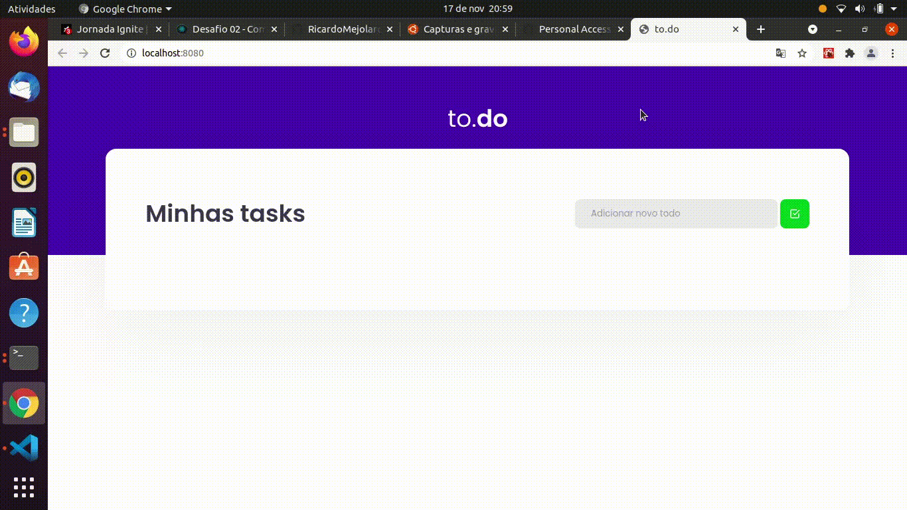

# 🚀 Projeto Desafio 01 Ignite Trilha ReactJS ✔️ <br>

## 📑️ Índice

- [O projeto](#📝️-Sobre)
- [Apresentação Gif](#🚀️-Apresentação-do-desafio)
- [Como usar](#💾️-Como-baixar/testar-o-projeto)
- [Contato](#-Desenvolvido-com-💙️-por)
- [Licença](#-Licença)

---

## 📝️ Sobre

<h2>
    O Projeto foi desenvolvido como desafio do módulo 1 do Ignite Trilha ReactJS: 
</h2>

## 🚀️ Apresentação do desafio


  
---

### 💾️ Como baixar/testar o projeto

- Você irá precisar instalar o [Git](https://git-scm.com/), [NodeJS](https://nodejs.org/pt-br/download/) + [Yarn](https://classic.yarnpkg.com/en/docs/install/) + [Visual Studio code](https://code.visualstudio.com/) ou seu editor de código preferido.

---

```bash
# Versões mínimas ou superiores.
$ node -v
v14.17.2

$ npm -v 
6.14.12

OU

$ yarn -v 
1.22.10

```

- Para configurar e rodar o projeto siga o passo a passo:

```bash
#Clonar o repositório na sua pasta de preferência, abrindo seu terminal de preferência e rodando o comando:
$ git clone https://github.com/RicardoMejolaro/RicardoMejolaro-Desafio-01-Jornada-ReactJS-Ignite-Rocketseat.git

#Acessar e abrir a pasta que foi efetuada o clone:
#Na pasta abrir projeto no VsCode ou no seu editor preferido:
$ No seu editor, procurar a pasta que recebeu o clone do projeto, selecionar e abrir.

#Abrir seu terminal de comando preferido via editor de código ou fora do editor, após acessar a pasta (no passo acima), acessar a pasta do projeto onde abrirá a branch master do repositório, com o comando:  
$ cd RicardoMejolaro-Desafio-01-Jornada-ReactJS-Ignite-Rocketseat

#Ao acessar o diretório acima mencionado, rodar o comando:
$ npm install ou yarn install (para instalar as dependências necessárias)

#Rodar o projeto com o comando:
$ npm dev ou yarn dev

#Pode testar o link: http://localhost:8080/ no seu navegador

Agora é só testar como no exemplo do gif acima!

```
---

### Desenvolvido com 💙️ por

***Ricardo Mejolaro*** 
<br/> 
<a href="https://www.linkedin.com/in/ricardo-mejolaro/">

</a>

### Licença

Este projeto está licenciado sob a licença MIT - consulte a página [LICENSE](https://opensource.org/licenses/MIT) para obter detalhes.
